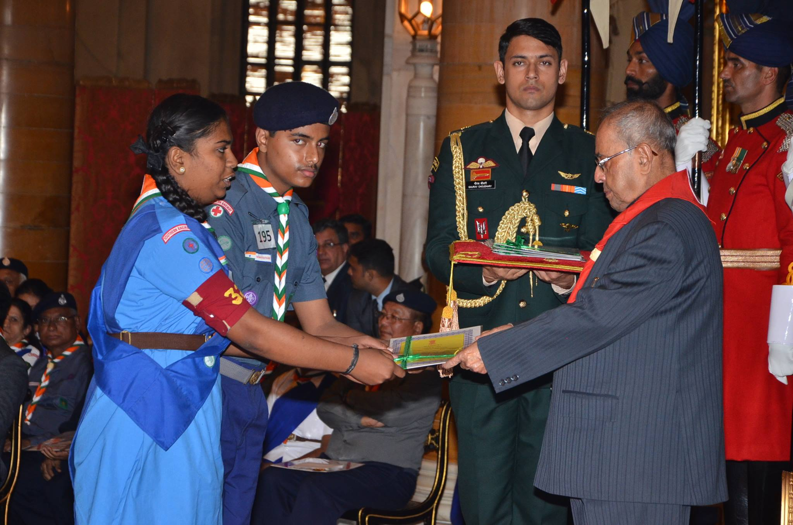

## About Me

I am an M.Sc. student in **Data Science and Artificial Intelligence (DSAI)** at [Saarland University](https://www.uni-saarland.de/en/home.html), Germany. I am currently a **Student Research Assistant** in the Trustworthy ML group at [CISPA Helmholtz Center for Information Security](https://cispa.de/en/research/groups/fritz), in the group of [Prof. Dr. Mario Fritz](https://cispa.saarland/group/fritz/). I was a Research Fellow at the [AI Safety Saarland Incubator](https://www.ais-saarland.org/) and a Student Research Assistant at [DFKI](https://www.dfki.de/en/web) in the Interactive Machine Learning group.

My work lies at the intersection of **A(G)I Safety** and **Human-AI Interaction** — with a particular focus on evaluating model safety for user welfare, identifying hidden biases, and understanding how language models can be adapted through multi-turn interactions and memory.

## Research Interests

- **A(G)I Safety:** evaluating LLM safety for user welfare, identifying failure modes of deployed AI systems
- **Personalization via Multi-Turn Interactions:** adapting language model behaviour through conversational context
- **Personalization from Memory:** enabling models to learn and retain user-specific knowledge across interactions

## News

- **[Feb. 2026]** Paper *"Challenges of Evaluating LLM Safety for User Welfare"* accepted to **IASEAI'26**.
- **[Dec. 2025]** Started as **Student Research Assistant** at **CISPA Helmholtz Center for Information Security** (Trustworthy ML group).
- **[Nov. 2025]** Paper *"Justice in Judgment: Unveiling (Hidden) Bias in LLM-assisted Peer Reviews"* presented at **NeurIPS 2025 Workshop on LLM Evaluation**.
- **[Nov. 2025]** Paper *"AuditCopilot: Leveraging LLMs for Fraud Detection in Double-Entry Bookkeeping"* presented at **NeurIPS 2025 Workshop on Generative AI in Finance**.
- **[Oct. 2025]** Selected as **Research Fellow** at the **AI Safety Saarland Incubator**.
- **[Jul. 2025]** Awarded the **Saarland Scholarship for International Students** (Summer Semester 2025).



## Beyond Research

I am an avid traveller — having explored 15+ countries across the world. Outside of academia, I enjoy staying updated on the latest in tech and culture through [X](https://x.com), and I am a big movie buff.

I am also a proud **President Scout Awardee**, having received the highest scouting honour in India from the Former President of India in December 2016.

  

